# Logs Dashboard: Engineering Direction

**Written:** 2026-04-01 | **Last Updated:** 2026-04-02

## Introduction

This logs dashboard is a portfolio piece demonstrating full-stack technical excellence. When I started this project, I knew the goal wasn't just to build another CRUD application—it was to showcase production-ready engineering practices across architecture, database optimization, analytics, testing, and documentation.

I treat this document as a window into my engineering thought process. Rather than listing features, I want to show you how I approach technical decisions systematically, using constraints to guide every choice. The application handles 100k+ logs with sub-500ms query times, but the real story is in the methodology I used to get there.

My approach throughout this project has been constraint-driven: define the hard requirements first (time, scale, scope), then let those constraints systematically filter options until the optimal choice becomes clear.

## Requirements

### Functional Requirements

I organized the feature set into four high-level categories, detailed in [REQUIREMENTS.md](./.planning/REQUIREMENTS.md):

| Category | Description |
|----------|-------------|
| **CRUD Operations** | Create, view, edit, delete logs with timestamp, message, severity, source fields |
| **Search & Filtering** | Filter by severity, source, date range, and message content with multi-filter support |
| **Analytics Dashboard** | Time-series charts and severity distribution with configurable date ranges |
| **Data Export** | Stream filtered logs as CSV with 50k row limit for memory safety |

The full requirements document lists 55 discrete requirements mapped to implementation phases. I kept the scope focused on demonstrating technical depth (database optimization, query performance, streaming responses) rather than breadth (auth systems, real-time updates, complex workflows).

**Out of scope:**
- User authentication (time constraint - prioritized technical depth over auth patterns)
- Real-time log streaming (complexity vs value - WebSocket infrastructure doesn't advance core demonstration goals)
- Multi-tenancy (single-deployment showcase keeps complexity manageable)

### Non-Functional Requirements

The system must satisfy these quality attributes:

| NFR Category | Requirement | Target | Why This Matters |
|--------------|-------------|--------|------------------|
| **Performance** | Pagination at any depth | <500ms query time | Below perceptual threshold - users perceive responses under 500ms as instantaneous |
| **Performance** | Analytics queries (30-day range) | <2s response time | Tolerable wait for complex analysis - users accept brief delays for data processing tasks |
| **Performance** | CSV export (50k rows) | <3s generation time | Reasonable download initiation - users expect short delay before file download starts |
| **Scalability** | Data volume support | 100k+ logs without degradation | Production-scale dataset - demonstrates patterns work beyond toy examples |
| **Scalability** | Concurrent users | Handle multiple simultaneous queries | Multi-user readiness - system remains responsive under realistic load |
| **Maintainability** | UI component updates | Single-source changes propagate globally | Development velocity - change once, affect everywhere reduces maintenance burden |
| **Maintainability** | Code modularity | Clear separation of concerns (API/UI/DB) | Testability and evolution - isolated layers enable independent changes and testing |
| **Reliability** | Error handling | Graceful degradation with meaningful error messages | User experience - clear feedback helps users recover from errors instead of confusion |
| **Reliability** | Data integrity | Timezone-aware timestamps, validated inputs | Data quality - prevents silent corruption that erodes trust in the system |

These NFRs drove every technical decision in the project. The "how" comes next in the technical deep dive.

## High Level Design

### CRUD Operations Flow

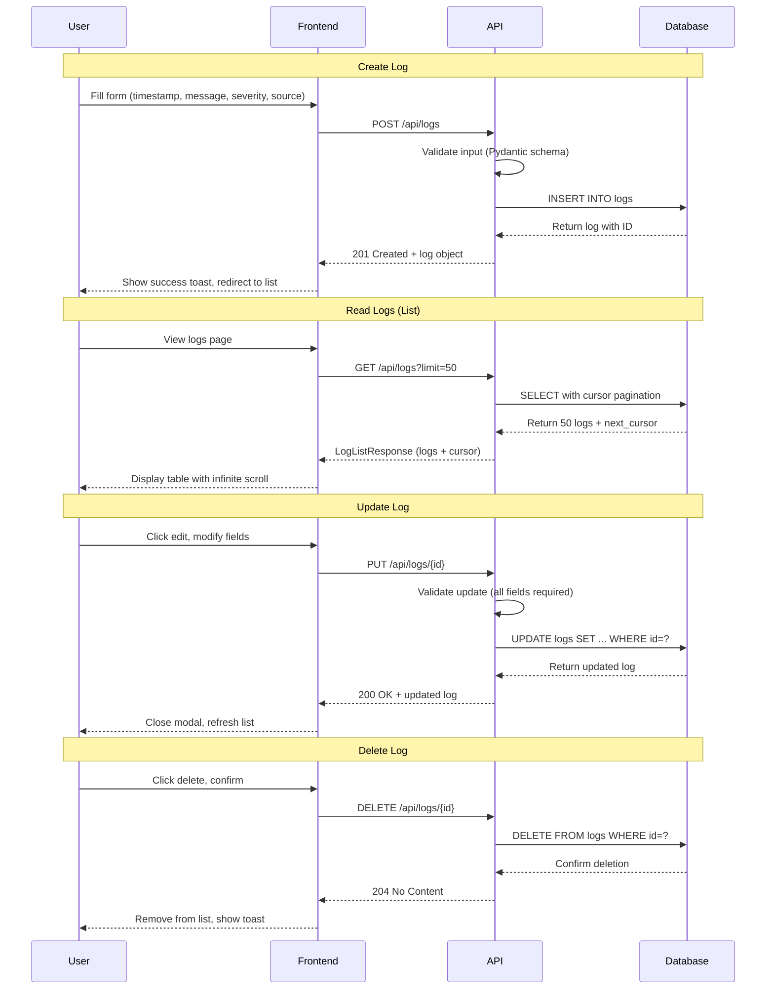

### Search & Filtering Flow

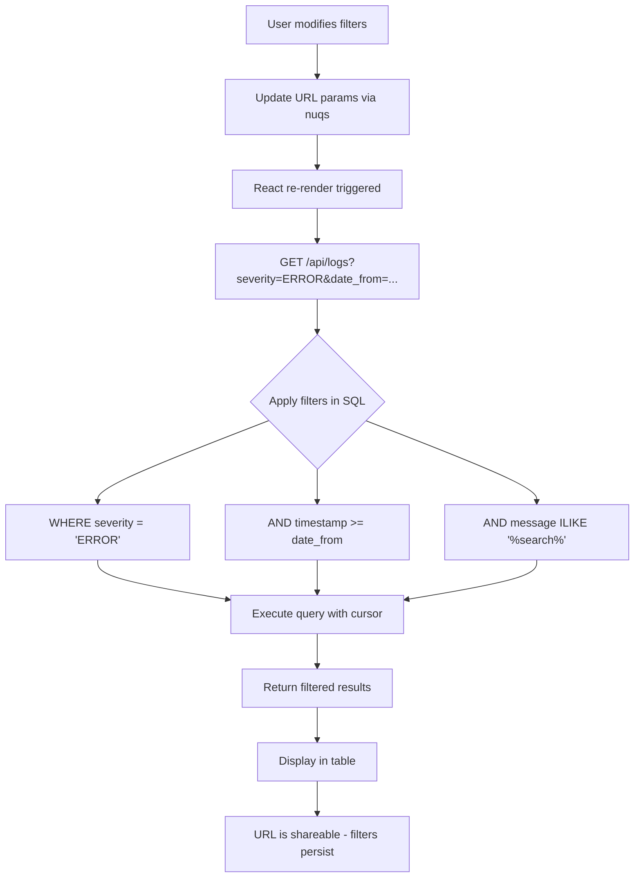

### Analytics Dashboard Flow

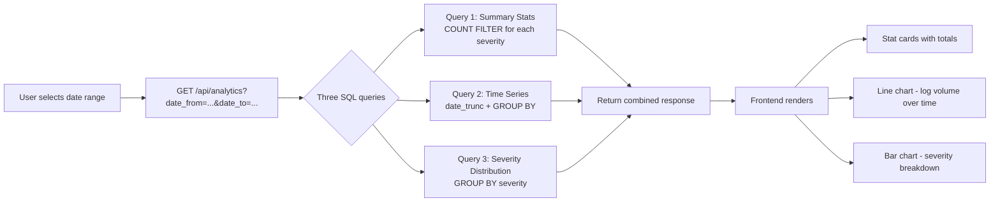

### Data Export Flow

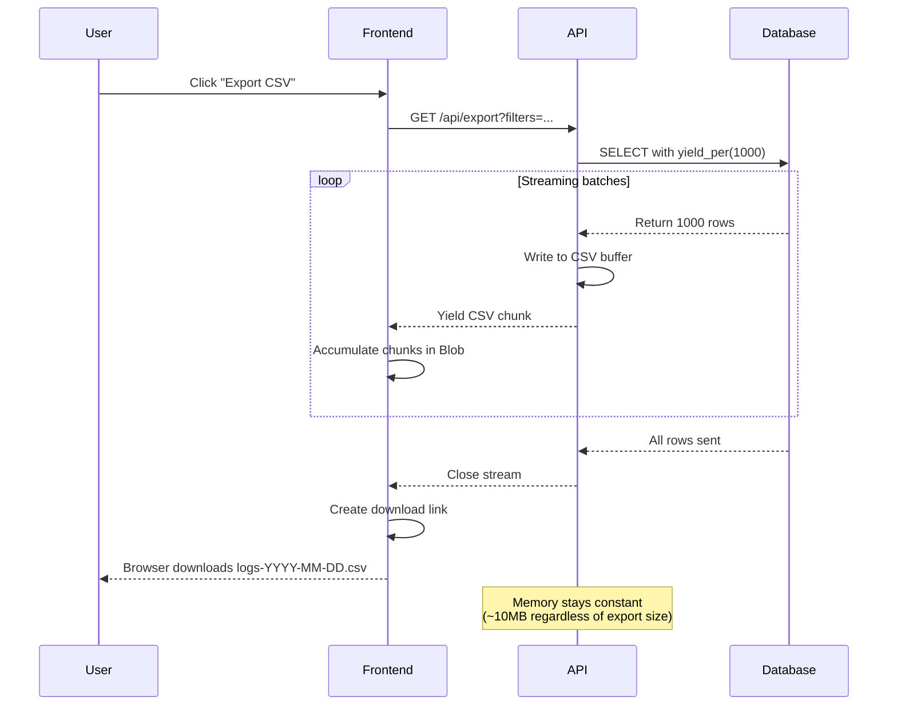

## Technical Deep Dive

This section explains the key technical challenges and how I addressed them.

### Performance - Pagination

**The concern:** With 100k logs, traditional offset pagination degrades at page depth. The database must scan all skipped rows before returning results.

**Approaches evaluated:**

**1. Offset pagination (LIMIT/OFFSET)**

How it works: `SELECT * FROM logs ORDER BY timestamp LIMIT 50 OFFSET 5000`

The database scans rows 0-5000, discards them, then returns rows 5001-5050.

Work scales with page depth:
- Page 100 (OFFSET 5000): Scan and discard 5000 rows
- Page 1000 (OFFSET 50000): Scan and discard 50,000 rows
- Performance: Degrades linearly because work increases proportionally

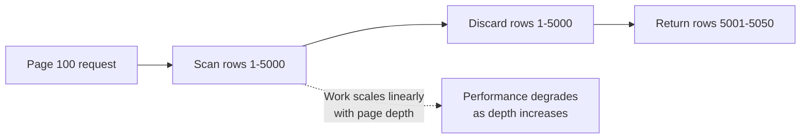

The critical issue: **query time increases linearly with page depth**. At some pagination depth (whether page 50, 100, or 200 depending on your hardware and configuration), you will hit the 500ms perceptual threshold where users notice lag. The deeper you paginate, the worse it gets. This degradation is inevitable with offset pagination.

**2. Cursor pagination**

How it works: `SELECT * FROM logs WHERE (timestamp, id) > (cursor_timestamp, cursor_id) ORDER BY timestamp LIMIT 50`

The database uses the B-tree index to seek directly to the cursor position, then returns the next 50 rows. No rows are scanned and discarded.

**Performance characteristics:**
- **Complexity:** O(log n) where n is total dataset size
  - 100k rows → ~17 B-tree comparisons
  - 10M rows → ~23 B-tree comparisons
  - Logarithmic growth is imperceptible in practice
- **Pagination depth independence:** Page 1 and page 1000 perform identically
- The work is always: "seek via B-tree (log₂ comparisons) + return next 50"

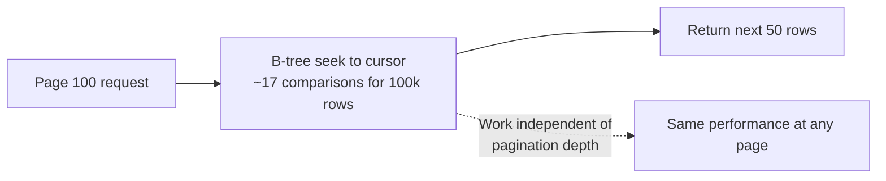

More complex implementation because you need to encode/decode cursors and handle composite keys. While technically O(log n) with respect to dataset size, performance remains consistent regardless of pagination depth—which is what users experience.

**3. Elasticsearch search-after**

How it works: Elasticsearch maintains inverted indexes mapping values to document IDs. The search-after parameter works like cursor pagination—seek to position in the index, return next page.

Performance is similar to cursor pagination (constant time), but requires running an Elasticsearch cluster alongside PostgreSQL. This adds operational overhead: cluster management, data synchronization, monitoring, backup strategy. For a demo project, this infrastructure complexity isn't justified.

**Decision:** I chose cursor pagination because it was the only SQL-based option meeting the <500ms constraint at any pagination depth. Its O(log n) complexity with respect to dataset size means performance remains consistent regardless of how deep you paginate, staying well below the perceptual threshold.

**Implementation:** Each query uses the last row's (timestamp, id) as the cursor. The WHERE clause uses the composite B-tree index to seek directly to that position (log₂ comparisons), then returns the next 50 rows sequentially. This achieves pagination-depth-independent performance—page 1 and page 1000 perform identically, both requiring the same ~17 B-tree traversal steps for a 100k-row dataset.

### Performance - Database Indexing

**The concern:** Without proper indexing, queries degrade quickly. Analytics queries scanning for date ranges (e.g., "last 30 days") must read all 100k rows to find matches. Filtered pagination queries combining timestamp + severity + source can't efficiently locate matching rows without indexes on all filter columns.

**Approaches evaluated:**

**1. Single B-tree on timestamp**

How it works: B-tree indexes organize values in a sorted tree structure, enabling fast range scans. A B-tree on timestamp allows queries like `WHERE timestamp BETWEEN x AND y` to seek directly to the start of the range and scan sequentially to the end.

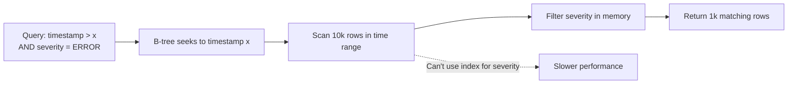

This works well for simple time-range queries (analytics queries without additional filters). However, when filters combine multiple columns (`WHERE timestamp > x AND severity = 'ERROR'`), the database can only use the timestamp portion of the index. It must then scan all rows in that time range and filter by severity in memory.

Example multi-column query inefficiency:
- Time range contains: 10k rows
- Matching severity: 1k rows
- Database must scan: 10k rows (then filter in memory)
- Database returns: 1k rows
- Result: Performance degrades proportionally to rows scanned, risking the 500ms perceptual threshold

**2. BRIN + separate B-trees**

How it works: BRIN (Block Range Index) is designed for time-series data where values correlate with physical storage order. Instead of indexing every row, BRIN divides the table into page blocks (typically 128 pages) and stores the min/max timestamp for each block. When executing `WHERE timestamp BETWEEN x AND y`, PostgreSQL checks each block's min/max range and skips blocks that fall entirely outside the query range.

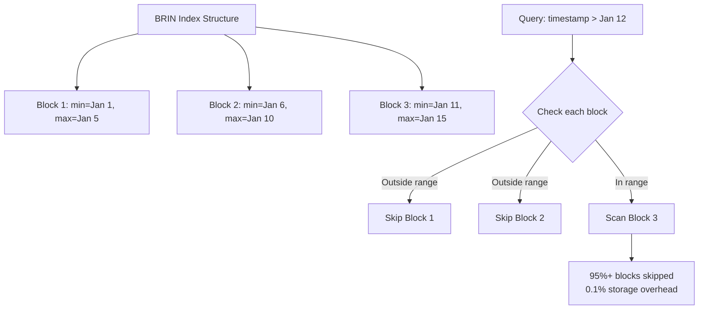

BRIN efficiency with chronological inserts:
- Blocks skipped for time-range queries: 95%+
- Storage overhead: 0.1% of table size
- Why so small: Stores one min/max pair per 128 pages (not per row)

The "separate B-trees" approach adds individual B-tree indexes on severity and source alongside the BRIN timestamp index. This means maintaining three separate index structures. The redundancy issue: when combining filters, PostgreSQL must choose which index to use and often picks only one, losing optimization from the others.

**3. Composite B-tree only**

How it works: A composite B-tree on (timestamp, severity, source) indexes all three columns together in a single tree structure. Queries filtering by timestamp alone, timestamp+severity, or timestamp+severity+source can all use this index efficiently because they match the index's left-to-right column order.

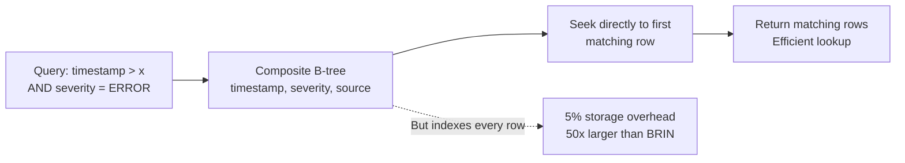

This handles multi-column filtering well—a query for `WHERE timestamp > x AND severity = 'ERROR'` seeks directly to the first row matching both conditions.

Storage trade-off:
- Indexes every row individually with full composite key
- 100k rows indexed
- Storage overhead: ~5% of table size
- Comparison: 50x larger than BRIN (5% vs 0.1%)
- Inefficient for time-series data mostly accessed by range scans

**4. Hybrid: BRIN + composite B-tree**

How it works: Combines BRIN on timestamp (for analytics range scans) with a composite B-tree on (timestamp, severity, source) for filtered pagination. PostgreSQL's query planner chooses the appropriate index based on query pattern:
- Time-range only queries use BRIN (block-level skipping, minimal storage)
- Multi-column filtered queries use composite B-tree (direct multi-column seeks)

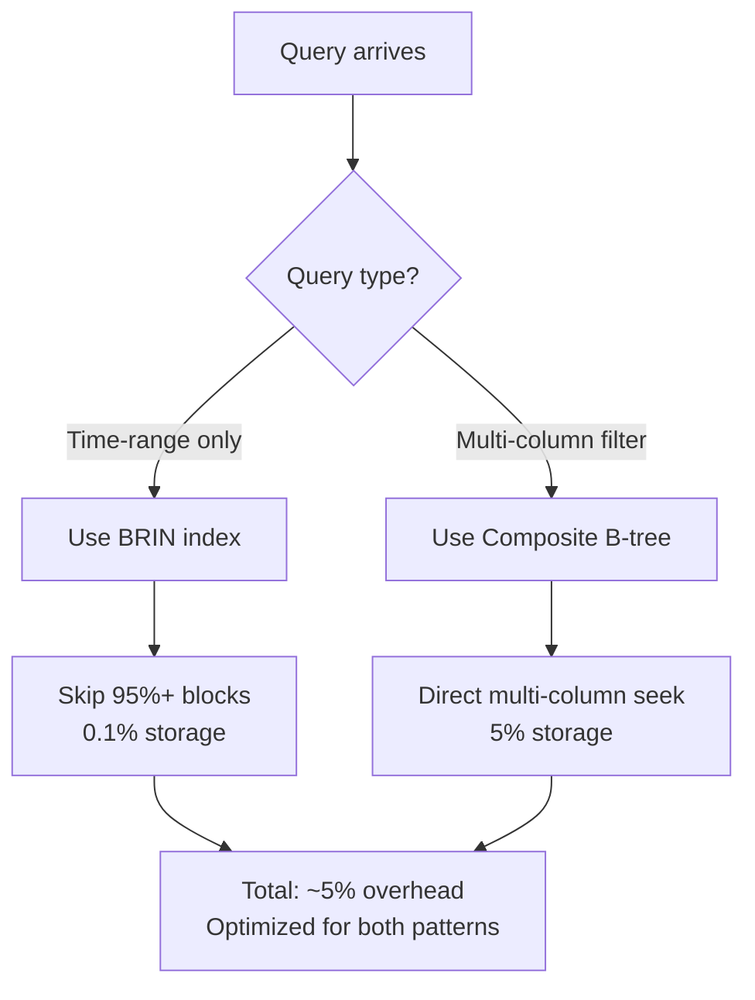

This requires understanding two access patterns but eliminates redundancy—no separate indexes competing for the query planner's attention.

Total storage calculation:
- BRIN index: 0.1%
- Composite B-tree: 5%
- Combined overhead: ~5%

**Decision:** I chose the hybrid approach because it optimizes both access patterns without redundant indexes. BRIN for analytics (time-series nature), composite B-tree for filtered pagination (multi-column seeks).

**Implementation:**

- **BRIN index on timestamp** - Analytics queries are time-range based. BRIN stores min/max timestamps per page block, letting PostgreSQL skip 95%+ of blocks during range scans. Storage overhead: 0.1%.

- **Composite B-tree on (timestamp, severity, source)** - Filtered pagination needs multi-column seeks. This index enables direct lookup for any filter combination. Storage overhead: 5%.

Total storage: ~5%. Query performance stays well within the 500ms perceptual threshold for any filter combination, making the UI feel instant to users.

### Performance - CSV Export

**The concern:** Loading 50k logs into memory (50k × ~200 bytes = ~100MB) causes memory spikes. In production, concurrent exports could exhaust available memory.

**Approaches evaluated:**

**1. Load all rows into memory**

How it works: Execute a single database query `SELECT * FROM logs WHERE ...`, fetch all results into a Python list, build the CSV string in memory, then send the complete file to the client.

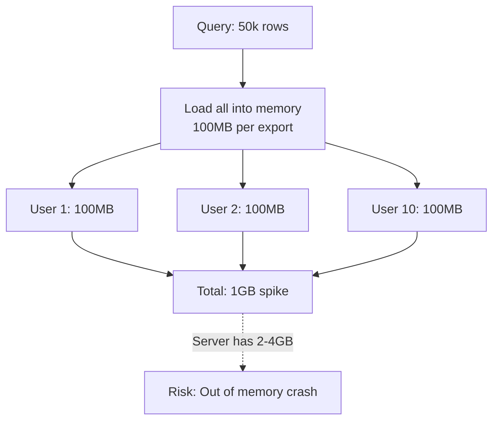

This is the straightforward approach: query.all() loads every row into memory as SQLAlchemy model objects.

Memory calculation per export:
- Each log row: ~200 bytes (timestamp, message, severity, source + Python object overhead)
- 50k rows raw data: 50,000 × 200 bytes = ~10MB
- Total with SQLAlchemy objects, CSV buffers, HTTP buffering: ~100MB

The problem with concurrent exports:
- 10 users exporting simultaneously: 10 × 100MB = 1GB memory spike
- Typical server allocation: 2-4GB RAM for application process
- Result: 4-5 concurrent exports cause out-of-memory errors, crash, or swap thrashing

Straightforward implementation but fails at scale with concurrent exports.

**2. Streaming with batching**

How it works: Execute the database query with SQLAlchemy's `yield_per(1000)` option, which configures the database driver to fetch results in batches of 1000 rows rather than loading everything at once. Iterate through results in chunks, writing each batch to a CSV buffer and yielding the formatted CSV chunk to the client via FastAPI's StreamingResponse. The client receives and saves data incrementally as it arrives.

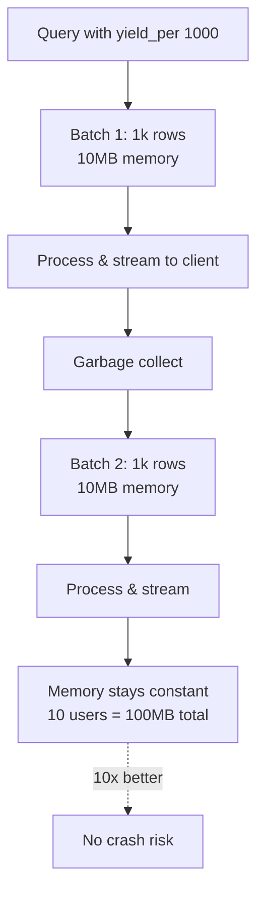

Memory behavior per batch:
- Batch size: 1000 rows
- Raw data in memory: ~200KB
- Total with buffers: ~2MB
- After processing: Garbage collector reclaims memory before next batch
- Database connection: Server-side cursor streams without buffering entire result set

Constant memory regardless of export size:
- 50k export: 10MB peak memory
- 500k export: 10MB peak memory (same!)
- Memory depends on batch size (1000 rows), not total rows

Concurrent export scaling:
- Load-all approach: 10 users = 10 × 100MB = 1GB
- Streaming approach: 10 users = 10 × 10MB = 100MB (10x better)

The trade-off: More complex implementation requiring async generator functions, proper cleanup of database cursors, and error handling for client disconnections mid-stream.

**Decision:** I chose streaming because it's the only approach that scales. With concurrent exports, the load-all approach could exhaust server memory. Streaming keeps memory constant regardless of export size or concurrency.

**Implementation:** SQLAlchemy's yield_per(1000) fetches 1000 rows at a time. As each batch completes, I write to CSV buffer and yield the chunk to the client via FastAPI StreamingResponse, then fetch the next batch. Memory usage stays constant at ~10MB regardless of export size.

### Maintainability - UI Component System

**The concern:** Updating UI styles across dozens of components becomes tedious and error-prone. Need a system where global changes (button variant, color scheme, spacing) propagate without touching every usage site.

**Alternative solutions:**

| Approach | Pros | Cons |
|----------|------|------|
| **Component library from scratch** | Maximum flexibility, full control | High maintenance burden, need to build accessibility, reinvent patterns |
| **Headless UI (Radix) + custom styling** | Accessible primitives, styling control, single-source updates | Requires setup and configuration |
| **Full library (Material UI, Chakra)** | Fast setup, comprehensive components | Opinionated styles, harder to customize, larger bundle size |

**Decision:** I chose shadcn/ui (Radix primitives + Tailwind CSS) because it balances control with maintainability. Full libraries are too opinionated for portfolio uniqueness. Building from scratch wastes time on solved problems (accessibility, keyboard navigation).

**Implementation:**
- **Single-source components** - Button, Badge, Table live in src/components/ui/. Edit once, changes propagate to all 20+ usage sites.
- **Variant system** - cva() config defines button variants (default, destructive, outline). Adding a new variant means editing one array, not hunting through files.
- **Type safety** - TypeScript props prevent misuse, making refactoring safe.

To change button styles globally: edit src/components/ui/button.tsx. To add a variant: extend the cva() config. No CSS-in-JS runtime overhead.

